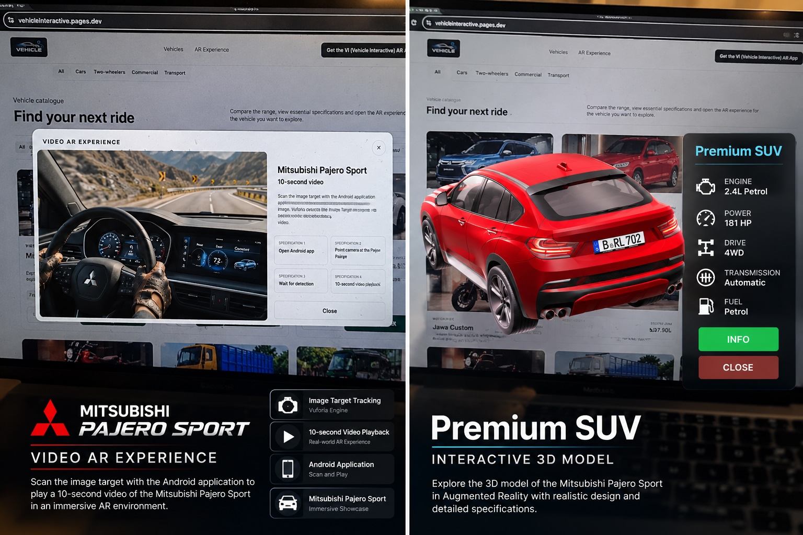

# Vehicle Interactive

An interactive vehicle showroom combining a web-based vehicle catalogue with an Android Augmented Reality application.

## Experience the Showroom

[Visit Vehicle Interactive Website](https://vehicleinteractive.pages.dev/)

## Project Preview

## Overview

Vehicle Interactive allows users to explore vehicles, view specifications and pricing, and experience 3D vehicles through Augmented Reality.

The AR application was developed with Unity and Vuforia, supporting image-target tracking, vehicle interaction, QR-based access, and Video AR.

## Key Features

- Interactive vehicle catalogue
- Vehicle specifications and pricing
- QR-based AR access
- 3D vehicle visualization
- Touch rotation and pinch-to-zoom
- Auto-rotation
- Vehicle information panels
- Audio interaction
- Video AR

## Technologies

- Unity
- C#
- Vuforia Engine
- HTML
- CSS
- JavaScript
- Cloudflare Pages

## Demo Video

[Watch the Project Demo Video](Assets/vehicle-interactive-demo.mp4)

## Project Context

Developed as my **main individual project** during my AR/VR/XR industrial training at Battery Low Interactive Ltd.

**Recognized as the Best Project by the Industry Board among all group and individual.**

